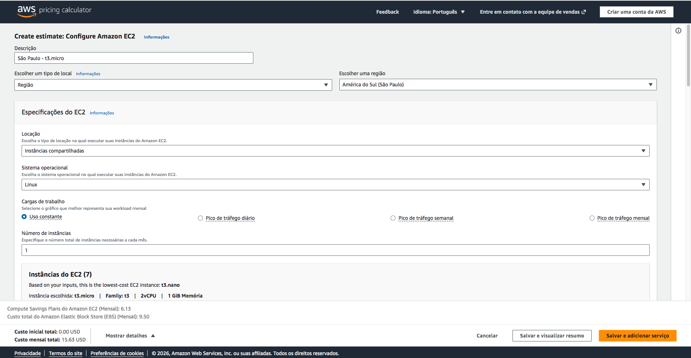
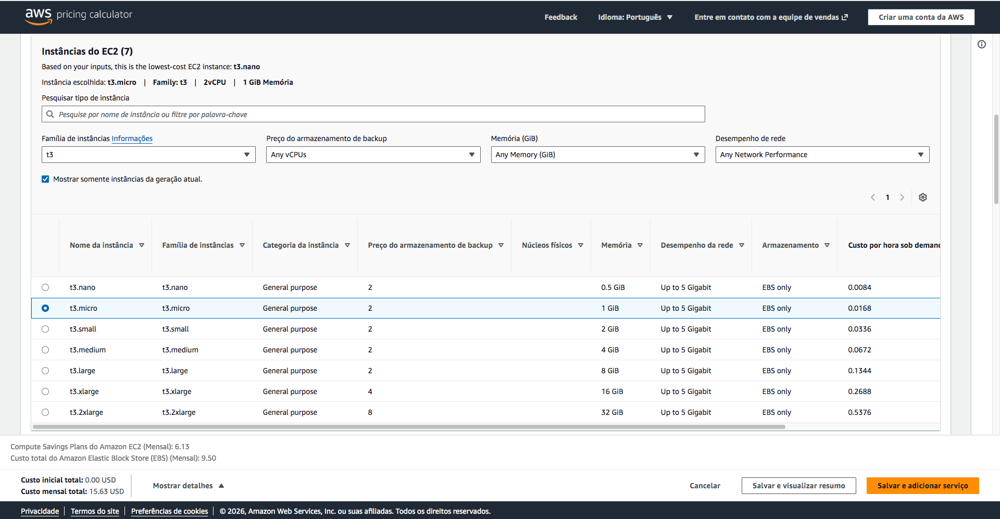
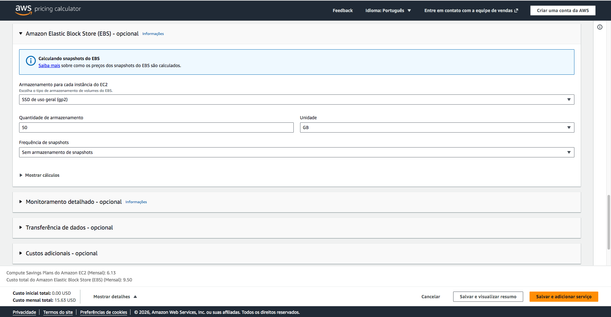
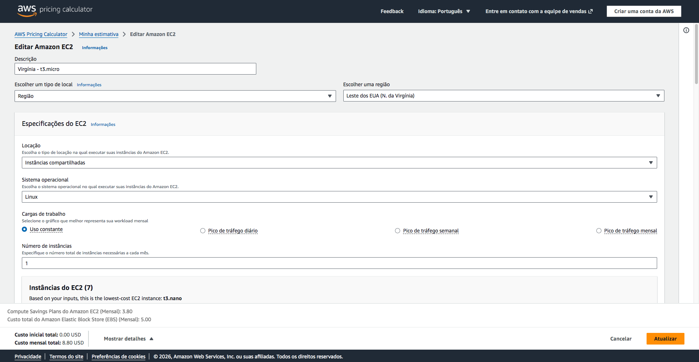
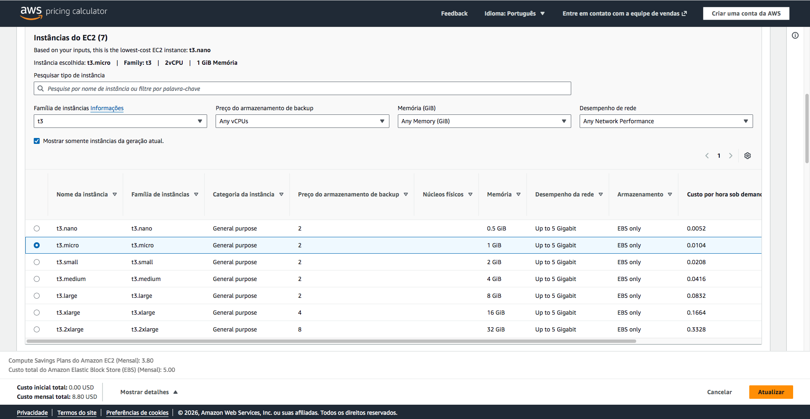
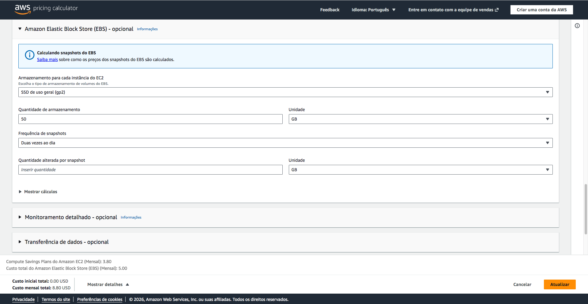

# FIAP - Faculdade de Informática e Administração Paulista

  

 

---
# PBL Fase 5: Machine Learning e Computação em Nuvem 

## Entrega 1: FarmTech Solutions: IA Agrícola Preditiva

## Descrição Rápida do Projeto
Na quinta fase do curso na FIAP, desenvolvemos para a FarmTech Solutions um sistema de inteligência artificial voltado a uma propriedade agrícola de 200 hectares. O projeto integra técnicas de Machine Learning Supervisionado, utilizando regressores para prever o rendimento de safras (Crop Yields) com base em variáveis de ambiente, e Machine Learning Não Supervisionado, para explorar padrões ocultos e tendências de produtividade na base de dados. O objetivo final é fornecer uma análise preditiva e estratégica que otimize o cultivo de múltiplas culturas de forma sustentável.

## Integrantes: 

  
  </a>
  
  
  
  

## Professores:
### Coordenador(a) / Tutor(a) 

  
  
  

## Como acessar o projeto completo

O ciclo completo da nossa solução — do desenvolvimento aos testes — está registrado de forma interativa e detalhadamente documentado no Jupyter Notebook disponível neste repositório.

Você pode acessá-lo clicando no link : [**Luiz_Frederico_rm567319_pbl_fase5.ipynb**](./Luiz_Frederico_rm567319_pbl_fase5.ipynb)

## Detalhamento da Implementação (Jupyter Notebook)

A solução foi estruturada para garantir a reprodutibilidade e clareza em cada etapa do desafio. O raciocínio lógico e as decisões técnicas estão documentados no notebook interativo, abrangendo os seguintes pilares:

### 1. Análise Exploratória de Dados (EDA)
Realizamos uma investigação profunda da base de dados para compreender a distribuição das variáveis e suas interdependências. Esta etapa inclui:
* **Análise Estatística:** Descritiva e visualização via **Histogramas, Boxplots e Pairplots**.
* **Estudo de Correlação:** Utilização de **Matrizes de Calor** para identificação de *features* críticas e relações entre variáveis.

### 2. Machine Learning Não Supervisionado & Clusterização
Exploramos padrões ocultos e anomalias na produção agrícola utilizando:
* **Algoritmos:** Implementação de **K-Means** para segmentação de comportamento e **DBSCAN** para identificação de *outliers* e densidade.
* **Otimização:** Aplicação dos métodos de **Cotovelo (Elbow Method)**, **K-Distâncias** e **Silhueta** para definição técnica de hiperparâmetros.
* **Visualização:** Utilização de **PCA (Principal Component Analysis)** para redução de dimensionalidade, facilitando a interpretação gráfica dos clusters.

### 3. Modelagem Preditiva Supervisionada (Regressão)
Desenvolvemos um *pipeline* robusto para a previsão de rendimento (*Crop Yield*):
* **Pré-processamento:** Tratamento de dados com **One-Hot Encoding** e normalização via **StandardScaler**.
* **Benchmarking:** Treinamento e teste de 5 algoritmos: *Linear Regression, Decision Tree, Random Forest, SVR e XGBoost*.
* **Validação:** Uso de **Cross-Validation (K-Fold)** para garantir a estabilidade e confiabilidade dos resultados.

### 4. Análise de Performance e Conclusões
Síntese dos resultados obtidos através da comparação rigorosa de métricas de erro e ajuste:
* **Métricas Avaliadas:** $R^2$, **RMSE** (Root Mean Squared Error) e **MAE** (Mean Absolute Error).
* **Discussão Crítica:** Análise sobre o desempenho dos modelos, limitações do *dataset* e conclusões estratégicas sobre o estudo de caso.

## Reprodutibilidade e Dependências

O **Jupyter Notebook** incluído neste repositório foi configurado para garantir a transparência total dos resultados. Todas as saídas — incluindo gráficos interativos, logs de processamento e métricas finais — estão devidamente **persistidas no cache**.

Isso significa que o arquivo pode ser visualizado e as conclusões podem ser validadas imediatamente, sem a necessidade de re-execução das células de código. 

> **Nota:** Para explorar os resultados e a documentação técnica detalhada, acesse o link do repositório ou abra o arquivo `.ipynb` diretamente através do visualizador do GitHub.

---
## Entrega 2 : Dimensionamento de Infraestrutura e Custos (AWS)

Como requisito da segunda entrega, elaboramos uma análise comparativa de viabilidade financeira utilizando o **AWS Pricing Calculator**. O objetivo foi projetar os custos operacionais da solução em duas zonas distintas: **São Paulo (sa-east-1)** e **Virgínia do Norte (us-east-1)**.

Esta etapa detalha as variações de investimento em serviços de computação e armazenamento, fundamentando a escolha da região ideal com base no equilíbrio entre orçamento, conformidade e latência.

## ☁️ Análise de Infraestrutura em Nuvem (AWS)

Como parte da disciplina de Computação em Nuvem, realizamos um estudo comparativo de custos e viabilidade técnica entre diferentes regiões da AWS para suportar a solução da **FarmTech Solutions**.

### 1. Quadro Comparativo de Custos (Estimativa Mensal)

| Região | Instância EC2 Linux (t3.micro) | Armazenamento (50GB EBS gp2 + Snapshots) | Total Mensal |
| :--- | :--- | :--- | :--- |
| **São Paulo (sa-east-1)** | $6,13 | $9,50 | **$15,63** |
| **Virgínia do Norte (us-east-1)** | $3,80 | $5,00 | **$8,80** |

### 2. Análise da Diferença de Custo
A região de **São Paulo** apresenta um custo mensal total de **$15,63**, enquanto a Virgínia do Norte custa **$8,80**, resultando em uma diferença nominal de **$6,83**. 

Isso significa que a opção brasileira é aproximadamente **77,6% mais cara** que a americana. 

### 3. Justificativa Técnica e Legal para Escolha da Região
Apesar do investimento superior, a região **São Paulo (sa-east-1)** foi a escolha estratégica para este projeto, fundamentada em dois pilares:

#### Conformidade Legal (LGPD)
A **Lei Geral de Proteção de Dados (LGPD)** impõe diretrizes rigorosas sobre o tratamento de dados. Como nossa solução utiliza sensores que podem coletar informações sensíveis de operações e clientes, manter o armazenamento em território nacional:
* Assegura a soberania dos dados.
* Simplifica a adequação jurídica.
* Mitiga riscos associados à transferência internacional de dados não autorizada.

#### Desempenho e Latência
A proximidade geográfica entre os sensores da fazenda e o datacenter reduz drasticamente a **latência de rede**. 
* **Tempo Real:** Uma API que processa modelos de Machine Learning exige respostas rápidas.
* **Estabilidade:** Menor distância física minimiza a perda de pacotes e garante a fluidez da aplicação, o que seria prejudicado pelos atrasos inerentes à conexão com servidores na América do Norte.

> **Conclusão:** Mesmo com o custo adicional, a região de São Paulo é a única que atende simultaneamente aos requisitos de performance técnica e segurança jurídica necessários para a operação da FarmTech Solutions.

#### 📸 Registros do AWS Pricing Calculator

## 📋 Licença

Projeto acadêmico - FIAP 2025 - está licenciado sobre <a href="http://creativecommons.org/licenses/by/4.0/?ref=chooser-v1" target="_blank" rel="license noopener noreferrer" style="display:inline-block;">Attribution 4.0 International</a>.

